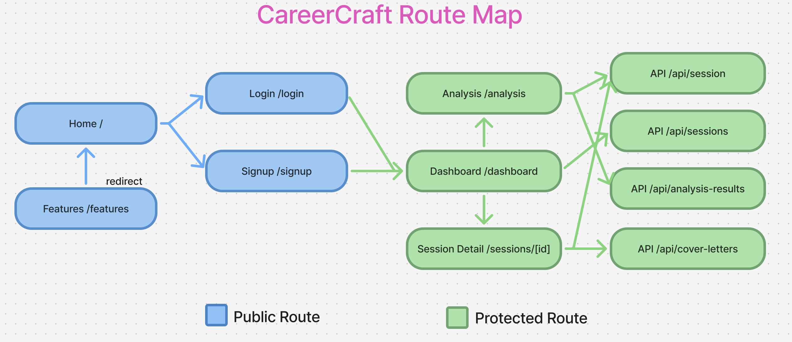
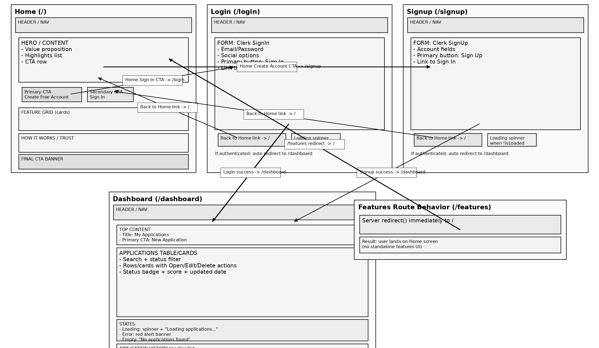
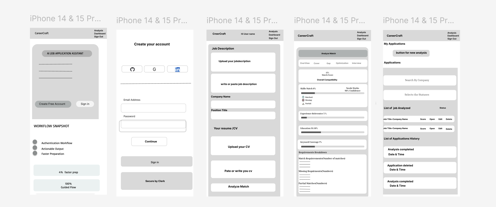
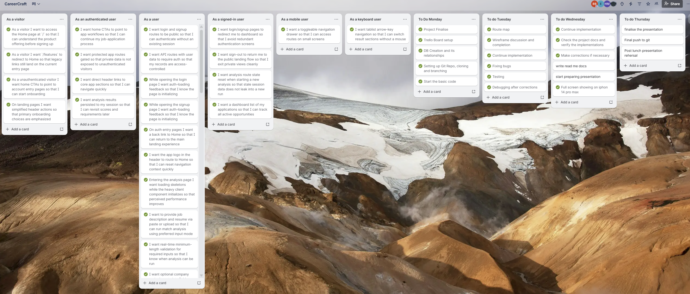
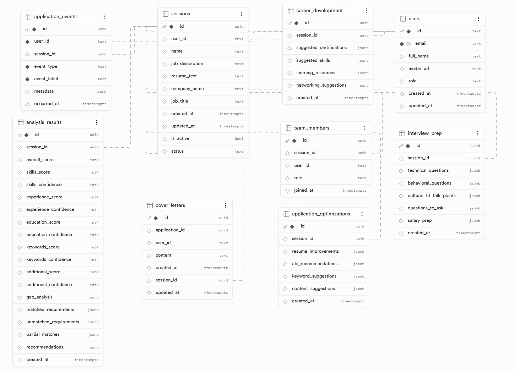
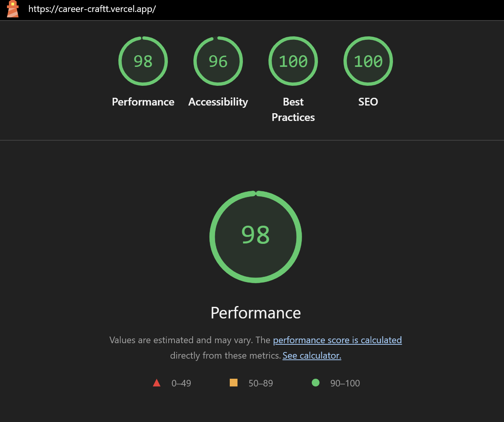

# CareerCraft

<p align="center">

</p>

<p align="center">
  <strong>Craft your path to the perfect job</strong>
</p>

<p align="center">
  <a href="https://career-craftt.vercel.app">🌐 Live Demo</a>
  •
  <a href="https://github.com/bh-official/CareerCraftt">🐙 GitHub</a>
</p>

## 📋 Table of Contents

- [Problem Domain](#problem-domain)
- [Team Members](#team-members)
- [MVP](#mvp-core-deliverables)
- [Stretch Goals Achieved](#stretch-goals-achieved)
- [Future Goals](#future-goals)
- [Route Map](#route-map)
- [Wireframes](#wireframes)
- [Core Features](#core-features)
- [User Stories](#user-stories)
- [Project Planning](#project-planning)
- [Application Architecture](#application-architecture)
- [The Tech Stack](#the-tech-stack)
- [Tools Used](#tools-used)
- [Database Schema](#database-schema)
- [Schema Visualizer](#schema-visualizer)
- [Security](#security)
- [API Endpoints](#api-endpoints)
- [Page Usability & Flow](#page-usability--flow)
- [Major Changes & Polish](#major-changes--polish)
- [Setup & Execution](#setup--execution)
- [Lighthouse](#lighthouse)
- [Reflection](#reflection)
- [Requirements Achieved](#requirements-achieved)
- [Challenges](#challenges)
- [What Went Well](#what-went-well)
- [What I Learned](#what-i-learned)
- [Areas for Improvement](#areas-for-improvement)
- [Future Enhancements](#future-enhancements)
- [Summary](#summary)

## Problem Domain

This project operates in the AI-assisted career and job application domain, focused on helping users move from opportunity discovery to confident submission through a single guided workflow. It enables candidates to analyze resume-to-job fit, identify skill and requirement gaps, generate tailored cover letters, receive ATS and readability optimization guidance, prepare for interviews, and plan ongoing career development steps. By combining these capabilities with authenticated user sessions, application tracking, and historical progress visibility, the system turns a typically fragmented job-search process into a structured, repeatable, and data-informed experience.

## Team members

- Bhuvaneswari Babu
- Delight Iwenofu
- Faisal Rehman
- Hema Mistry
- Lukas Mackevicius

Although responsibilities were initially divided into planning, frontend, backend, database, and deployment, all team members actively collaborated across the entire codebase. Each member contributed to multiple areas including UI development, API integration, debugging, and testing, ensuring shared ownership of the project.

## MVP (Core Deliverables)

- User authentication and account access flow (sign up, sign in, sign out).
- Landing experience and guided entry into the app workflow.
- Resume + job description analysis with match scoring and gap insights.
- AI-generated outputs for cover letter, optimization suggestions, interview prep, and career development.
- Dashboard/session tracking so users can view and continue application work.

## Stretch Goals Achieved

- Polished navigation behavior and route handling (including clean landing/redirect behavior).
- Personalized authenticated header experience (user greeting + profile avatar fallback).
- Improved auth-page UX consistency through shared layout refactor.
- Expanded API surface for modular generation and retrieval flows.
- Interview preparation generation
- Career development suggestions
- Resume optimization tips
- Advanced analytics and event tracking
- File upload and parsing

## Future Goals

- Team collaboration UI to activate existing shared-access foundations.
- Advanced filtering, analytics, and trend insights in dashboard history.
- Automated testing coverage expansion (integration/e2e around auth + AI flows).
- Background jobs/queueing for heavier AI operations and better scalability.
- Export/share enhancements (portfolio-ready reports, application bundles).
- Usage limits/plan management and production-grade observability.

## Route Map (App Router)



## Wireframes

**Desktop Version**



**Mobile Version**



## Core Features

- AI-assisted job/resume analysis with scoring and requirement matching
- Cover letter generation and stored cover-letter records
- Interview prep suggestions (technical + behavioral)
- Resume/application optimization guidance
- Career development recommendations
- Session-based workflow with history and per-session detail pages
- Application event tracking for timeline/activity views
- File upload and parsing support for PDF/DOCX/TXT resumes
- Authentication and protected routes using Clerk
- Keyboard and screen-reader accessibility support (ARIA, skip links, focus-visible styles)
- Code comments throughout for improved maintainability

## User Stories

- US-001 As a visitor I want to access the Home page at `/` so that I can understand the product offering before signing up
- US-002 As a visitor I want `/features` to redirect to Home so that legacy links still land on the current entry page
- US-003 As a unauthenticated visitor I want home CTAs to point to account entry pages so that I can start onboarding
- US-004 As a authenticated user I want home CTAs to point to app workflows so that I can continue my job-application process
- US-005 As a user I want login and signup routes to be public so that I can authenticate without an existing session
- US-006 As a authenticated user I want protected app routes gated so that private data is not exposed to unauthenticated visitors
- US-007 As a authenticated user I want API routes with user data to require auth so that my records are access-controlled
- US-008 As a user opening the login page I want auth-loading feedback so that I know the page is initializing
- US-009 As a user opening the signup page I want auth-loading feedback so that I know the page is initializing
- US-010 As a already-signed-in user I want login/signup pages to redirect me to dashboard so that I avoid redundant authentication screens
- US-011 As a user on auth entry pages I want a back link to Home so that I can return to the main landing experience
- US-012 As a user I want the app logo in the header to route to Home so that I can reset navigation context quickly
- US-013 As a visitor on landing pages I want simplified header actions so that primary onboarding choices are emphasized
- US-014 As a authenticated user I want direct header links to core app sections so that I can navigate quickly
- US-015 As a mobile user I want a toggleable navigation drawer so that I can access routes on small screens
- US-016 As a signed-in user I want sign-out to return me to the public landing flow so that I exit private views cleanly
- US-017 As a signed-in user I want analysis route state reset when starting a new analysis so that stale session data does not leak into a new run
- US-018 As a user entering the analysis page I want loading skeletons while the heavy client component initializes so that perceived performance improves
- US-019 As a user I want to provide job description and resume via paste or upload so that I can run match analysis using preferred input mode
- US-020 As a user I want real-time minimum-length validation for required inputs so that I know when analysis can be run
- US-021 As a user I want optional company and role metadata fields so that generated outputs can be better personalized
- US-022 As a user I want a clear analyzing state so that I know when the match request is in progress
- US-023 As a user I want analysis errors surfaced prominently so that I can understand why generation failed
- US-024 As a user I want post-analysis tabbed results so that I can inspect outputs by category
- US-025 As a keyboard user I want tablist arrow-key navigation so that I can switch result sections without a mouse
- US-026 As a user I want overview scoring and requirement breakdown so that I can evaluate fit quickly
- US-027 As a user I want gap analysis grouped by severity so that remediation priorities are obvious
- US-028 As a user I want on-demand cover letter generation from analysis context so that I can create tailored application copy
- US-029 As a user I want basic cover letter editing and copy actions so that I can reuse and refine generated text
- US-030 As a user I want on-demand optimization generation so that I can improve ATS and content quality
- US-031 As a user I want on-demand interview preparation generation so that I can prepare targeted answers and questions
- US-032 As a user I want on-demand career development generation so that I can plan longer-term professional growth
- US-033 As a user opening a saved session URL I want persisted data restored into analysis context so that I can continue from prior work
- US-034 As a user opening a session I want clear loading and error states so that I understand retrieval progress and failure outcomes
- US-035 As a user viewing a loaded session I want quick navigation back to dashboard so that I can return to my application list
- US-036 As a signed-in user I want a dashboard list of my applications so that I can track all active opportunities
- US-037 As a user I want search and status filtering so that I can find relevant applications quickly
- US-038 As a user I want explicit loading, empty, and error states in dashboard lists so that data-state transitions are understandable
- US-039 As a user I want to open any application into its session workspace so that I can continue editing and generation
- US-040 As a user I want to edit application metadata and status so that my tracker stays accurate
- US-041 As a user I want optimistic UI updates during edits so that the interface feels responsive
- US-042 As a user I want guarded deletion with confirmation so that I do not remove applications accidentally
- US-043 As a user I want an application history timeline so that I can audit lifecycle activity
- US-044 As a user I want drag-and-drop and click upload support so that I can submit documents in the fastest way for my device
- US-045 As a user I want strict client-side file validation so that unsupported files fail fast
- US-046 As a user I want server-side extraction errors surfaced so that I can correct problematic documents
- US-047 As a authenticated user I want analysis results persisted to my session so that I can revisit scores and requirements later
- US-048 As a user rerunning analysis on an existing session I want authorization checks enforced so that I cannot mutate another user’s session
- US-049 As a user I want lifecycle events captured automatically so that history reflects key actions
- US-050 As a user I want optional generated artifacts saved against my session so that I can reopen them later
- US-051 As a user I want consistent API validation errors so that bad inputs are diagnosable and testable
- US-052 As a accessibility-focused user I want core landmarks and skip navigation so that keyboard/screen-reader navigation is efficient

## Project Planning



## Application Architecture

The project follows a standard Next.js App Router structure with organised code.

```text
CareerCraft/
├── .gitignore
├── README.md
├── SQL.SQL
└── src/
    ├── app/
    │   ├── error.jsx
    │   ├── favicon.ico
    │   ├── globals.css
    │   ├── layout.js
    │   ├── page.js
    │   ├── analysis/
    │   │   └── page.js
    │   ├── api/
    │   │   ├── analysis-results/
    │   │   │   └── route.js
    │   │   ├── analyze/
    │   │   │   └── route.js
    │   │   ├── application-events/
    │   │   │   └── route.js
    │   │   ├── applications/
    │   │   │   └── route.js
    │   │   ├── career/
    │   │   │   └── route.js
    │   │   ├── cover-letter/
    │   │   │   └── route.js
    │   │   ├── cover-letters/
    │   │   │   └── route.js
    │   │   ├── interview/
    │   │   │   └── route.js
    │   │   ├── optimization/
    │   │   │   └── route.js
    │   │   ├── session/
    │   │   │   └── route.js
    │   │   ├── sessions/
    │   │   │   └── route.js
    │   │   └── upload/
    │   │       └── route.js
    │   ├── dashboard/
    │   │   └── page.js
    │   ├── features/
    │   │   └── page.js
    │   ├── login/
    │   │   └── [[...rest]]/
    │   │       └── page.js
    │   ├── sessions/
    │   │   └── [id]/
    │   │       └── page.js
    │   ├── signup/
    │   │   └── [[...rest]]/
    │   │       └── page.js
    ├── components/
    │   ├── AnalysisPage.jsx
    │   ├── AppHeader.jsx
    │   ├── CareerDevelopment.jsx
    │   ├── CoverLetterEditor.jsx
    │   ├── FileUploader.jsx
    │   ├── GapList.jsx
    │   ├── InterviewPrep.jsx
    │   ├── Logo.jsx
    │   ├── OptimizationTips.jsx
    │   ├── ScoreCard.jsx
    │   ├── Tabs.jsx
    │   ├── auth/
    │   │   └── AuthLayout.jsx
    │   └── dashboard/
    │       ├── ApplicationsHistorySection.jsx
    │       ├── ApplicationsSection.jsx
    │       ├── constants.js
    │       ├── DeleteConfirmationModal.jsx
    │       ├── EditApplicationModal.jsx
    │       └── utils.js
    ├── context/
    │   └── AnalysisContext.jsx
    ├── lib/
    │   ├── aiService.js
    │   ├── applicationEvents.js
    │   ├── db.js
    │   ├── ensureUserRecord.js
    │   ├── export.js
    │   └── fileProcessing.js
    └── proxy.ts
```

## The Tech Stack

- **Framework**: Next.js 16.2 (App Router)
- **Frontend**: React 19.2, Tailwind CSS 4, Framer Motion, Lucide React
- **UI Primitives**: Radix UI Tabs and Icons
- **Backend**: Next.js Route Handlers (`src/app/api/*`)
- **Database**: PostgreSQL using `pg` (Supabase-compatible)
- **Authentication**: Clerk (`@clerk/nextjs`)
- **AI Integration**: OpenRouter API (via `src/lib/aiService.js`)
- **File Processing**: `pdf-parse` and `mammoth`
- **Exporting**: `jspdf`
- **Code Quality**: ESLint 9 + `eslint-config-next`

## Tools Used

### Core Framework & Runtime

- **Next.js 16.2 (App Router)** - Full-stack React framework
- **React 19.2** - UI library

### Frontend & UI

- **Tailwind CSS 4** - Utility-first CSS framework
- **Framer Motion** - Animation library
- **Lucide React** - Icon library
- **Radix UI** - UI primitives (Tabs and Icons)

### Backend & API

- **Next.js Route Handlers** - Backend API endpoints
- **Clerk** - Authentication and user management

### AI & Integrations

- **OpenRouter API** - AI service integration
- **pdf-parse** - PDF file processing
- **jspdf** - PDF export functionality

### Data & Storage

- **PostgreSQL** - Primary database (Supabase-compatible)
- **pg** - PostgreSQL client for Node.js

### Development & Quality

- **ESLint 9** Code quality and linting
- **npm** - Package management

### Collaboration & Project Management

- **Git** - Version control
- **GitHub** - Code hosting and collaboration
- **VS Code** - Primary development environment
- **Trello** - Project management and task tracking
- **Figma** - UI design and prototyping
- **Discord** - Team communication
- **Microsoft ClipChamp** - Video editing
- **OBS Studio** - Screen recording
- **Google Meet** - Video conferencing
- **Google Slides** - Presentation creation

### Deployment

- **Vercel** - Hosting and deployment platform

## Database Schema

The database schema consists of 9 tables with well-defined relationships. Key tables include:

- `users` - Stores user authentication data
- `sessions` - Tracks user analysis sessions
- `analysis_results` - Stores AI analysis results
- `cover_letters` - Contains generated cover letters
- `application_optimizations` - Stores optimization suggestions
- `interview_prep` - Contains interview preparation content
- `career_development` - Stores career development advice
- `team_members` - Manages team collaboration
- `application_events` - Tracks application status changes

Cardinality Summary

- users (1) -> (many) sessions
- users (1) -> (many) application_events
- users (1) -> (many) team_members
- sessions (1) -> (many) application_events (nullable session_id due to SET NULL)
- sessions (1) -> (many) team_members
- sessions (1) -> (0..1 or many depending on write path) analysis_results
- sessions (1) -> (0..many) cover_letters
- sessions (1) -> (0..many) application_optimizations
- sessions (1) -> (0..many) interview_prep
- sessions (1) -> (0..many) career_development

## Schema Visualizer



## Security

- Authentication via Clerk (secure, industry-standard)
- Protected API routes with middleware
- Environment variables for secrets
- Input validation and sanitization
- CORS and security headers configured

## API Endpoints

### Core AI / Analysis

- `POST /api/analyze` - Analyze job description vs resume
- `POST /api/cover-letter` - Generate cover letter content
- `POST /api/interview` - Generate interview prep content
- `POST /api/optimization` - Generate optimization tips
- `POST /api/career` - Generate career development suggestions

### Application Management

- `GET /api/applications` - Get all applications
- `POST /api/applications` - Create new application
- `PUT /api/applications` - Update application
- `DELETE /api/applications` - Delete application

### Session and Result Data

- `/api/session` - `GET`, `POST`, `PUT`, `DELETE`
- `/api/sessions` - `GET`
- `/api/analysis-results` - `GET`, `POST`, `PUT`, `DELETE`
- `/api/cover-letters` - `GET`, `POST`, `PUT`, `DELETE`
- `/api/applications` - `GET`, `PUT`, `DELETE`
- `/api/application-events` - `GET`

### Upload

- `POST /api/upload` - Upload and parse a resume file

## Page Usability & Flow

- Landing page introduces the application and prompts for login
- Dashboard shows applications and recent activity
- Analysis page allows users to input job description and resume for AI analysis
- Results are displayed in tabs: Overview, Cover Letter, Gaps, Optimization, Interview, Career Development
- Users can generate and save cover letters, optimization tips, etc.
- Application history tracks all events

## Major Changes & Polish

- Added comprehensive code comments for maintainability
- Improved accessibility with ARIA labels, skip links, and focus-visible styles
- Enhanced error handling and loading states
- Optimized file upload and processing
- Refined UI with Tailwind CSS and Lucide icons
- Implemented optimistic UI updates for better user experience
- Implemented built-in accessibility voice support for screen reader users (Narrator/VoiceOver) and keyboard users
- Used TypeScript for type safety and better developer experience
- Focus-visible styling
- ARIA labels and relationships (`aria-label`, `aria-describedby`, `aria-labelledby`)
- Live regions (`aria-live`) and status/alert roles
- Keyboard-operable interactive controls
- Used Motion UI for animations and transitions

## Setup & Execution

### Prerequisites

- Node.js 18+
- PostgreSQL database (Supabase recommended)
- OpenRouter API key
- Clerk project keys

### Installation

1. Clone the repository:

```bash
git clone <repository-url>
cd CareerCraft
```

2. Install dependencies:

```bash
npm install
```

3. Create a `.env` file in the project root and add required values (see Environment Variables section).
4. Initialize your database schema:

Run SQL from `SQL.SQL` in your Postgres/Supabase SQL editor.

5. Run the development server:

```bash
npm run dev
```

6. Open [http://localhost:3000](http://localhost:3000).

### Environment Variables

| Variable                            | Required | Description                        |
| ----------------------------------- | -------- | ---------------------------------- |
| `OPENROUTER_API_KEY`                | Yes      | OpenRouter API key for AI features |
| `DATABASE_URL`                      | Yes      | PostgreSQL connection string       |
| `NEXT_PUBLIC_CLERK_PUBLISHABLE_KEY` | Yes      | Clerk publishable key              |
| `CLERK_SECRET_KEY`                  | Yes      | Clerk secret key                   |

## Lighthouse



## Reflection

This project was developed as a comprehensive solution to help job seekers navigate the application process. The integration of AI for analysis and generation of materials provides significant value. The use of modern technologies like Next.js, Tailwind, and Clerk allowed for rapid development and deployment.

## Requirements Achieved

All core requirements from the initial specification have been met:

- AI-powered job/resume analysis
- Cover letter, interview prep, optimization, and career development generation
- Full CRUD operations for applications and analysis results
- Authentication and authorization
- File upload and parsing
- Responsive and accessible UI

## Challenges

- Integrating multiple AI services and handling their varied response formats
- Managing state across multiple tabs and components in a complex UI
- Ensuring data consistency and handling concurrent updates
- Optimizing performance for file processing and AI API calls
- Implementing robust authentication and authorization

## What Went Well

- The modular architecture made it easy to add new features
- Using Next.js API routes simplified backend development
- Tailwind CSS enabled rapid UI development
- Clerk authentication saved significant development time

## What we Learned

- Advanced Next.js features like App Router and Route Handlers
- Effective state management with React Context
- Best practices for AI integration and prompt engineering
- Techniques for optimizing file processing in the browser
- Importance of accessibility from the start of development

## Areas for Improvement

- Adding unit and integration tests
- Implementing caching for AI responses to reduce costs and improve speed
- Adding dark mode support
- Enhancing mobile responsiveness further
- Adding more export options (PDF, Word, etc.)

## Future Enhancements

- Integration with LinkedIn and other professional networks
- Real-time collaboration features for career coaches and mentors
- Advanced analytics dashboard with job market trends
- Personalized learning path recommendations
- AI-powered mock interview practice

## Summary

CareerCraft is a full-featured application that leverages AI to streamline the job application process. From analyzing job fits to generating personalized application materials and tracking progress, it provides a comprehensive toolkit for job seekers. The project demonstrates modern web development practices with a focus on usability, accessibility, and maintainability.
