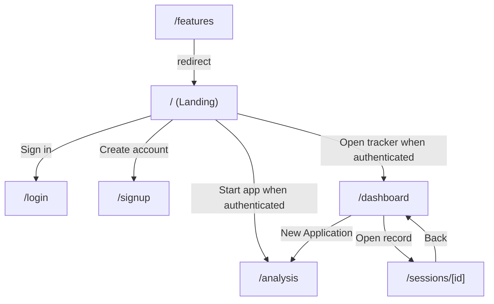

# CareerCraft Route Map

## 1) Route Access Overview

```mermaid
flowchart LR
  subgraph Public[Public Routes]
    HOME[/ /]
    FEAT[/features]
    LOGIN[/login]
    SIGNUP[/signup]
    UPLOAD[/api/upload]
  end

  subgraph Protected[Protected Routes]
    ANALYSIS[/analysis]
    DASH[/dashboard]
    SESSION_DETAIL[/sessions/[id]]
    API_SESSION[/api/session]
    API_SESSIONS[/api/sessions]
    API_ANALYSIS_RESULTS[/api/analysis-results]
    API_COVER_LETTERS[/api/cover-letters]
  end

  HOME --> LOGIN
  HOME --> SIGNUP
  LOGIN --> DASH
  SIGNUP --> DASH
  DASH --> ANALYSIS
  DASH --> SESSION_DETAIL

  ANALYSIS --> API_SESSION
  ANALYSIS --> API_ANALYSIS_RESULTS
  SESSION_DETAIL --> API_SESSION
  DASH --> API_SESSIONS
  SESSION_DETAIL --> API_COVER_LETTERS
```

---

## 2) App Page Route Map (UI)



---

## 3) API Route Map

```mermaid
flowchart TB
  ANALYSIS_CLIENT[Analysis UI] --> ANALYZE_API[POST /api/analyze]
  ANALYSIS_CLIENT --> COVER_LETTER_API[POST /api/cover-letter]
  ANALYSIS_CLIENT --> INTERVIEW_API[POST /api/interview]
  ANALYSIS_CLIENT --> OPT_API[POST /api/optimization]
  ANALYSIS_CLIENT --> CAREER_API[POST /api/career]
  ANALYSIS_CLIENT --> UPLOAD_API[POST /api/upload]

  DASH_CLIENT[Dashboard UI] --> APPS_API[/api/applications]
  DASH_CLIENT --> EVENTS_API[GET /api/application-events]

  SESSION_CLIENT[Session UI] --> SESSION_API[/api/session]
  SESSION_CLIENT --> SESSIONS_API[GET /api/sessions]
  SESSION_CLIENT --> RESULTS_API[/api/analysis-results]
  SESSION_CLIENT --> COVER_LETTERS_API[/api/cover-letters]
```

---

## 4) Security Notes (Auth Gate)

- Middleware-based protection is configured in [`src/proxy.ts`](src/proxy.ts).
- Global auth provider is configured in [`src/app/layout.js`](src/app/layout.js).
- Protected APIs validate user identity server-side via [`auth()`](src/app/api/session/route.js:28).

---

## 5) Source Evidence

- Route protection config: [`src/proxy.ts`](src/proxy.ts)
- App routes: [`src/app`](src/app)
- Session page route: [`src/app/sessions/[id]/page.js`](src/app/sessions/[id]/page.js)
- Dashboard route: [`src/app/dashboard/page.js`](src/app/dashboard/page.js)
- API routes root: [`src/app/api`](src/app/api)
