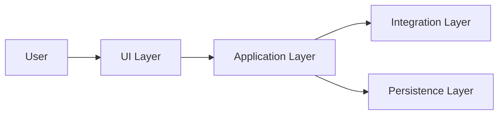
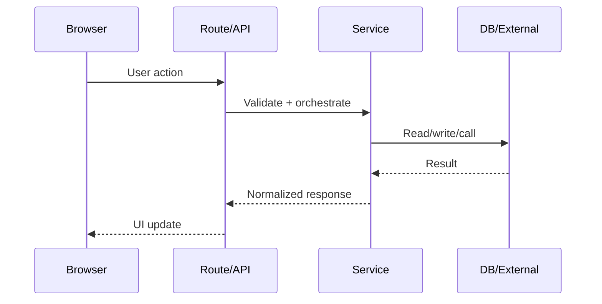
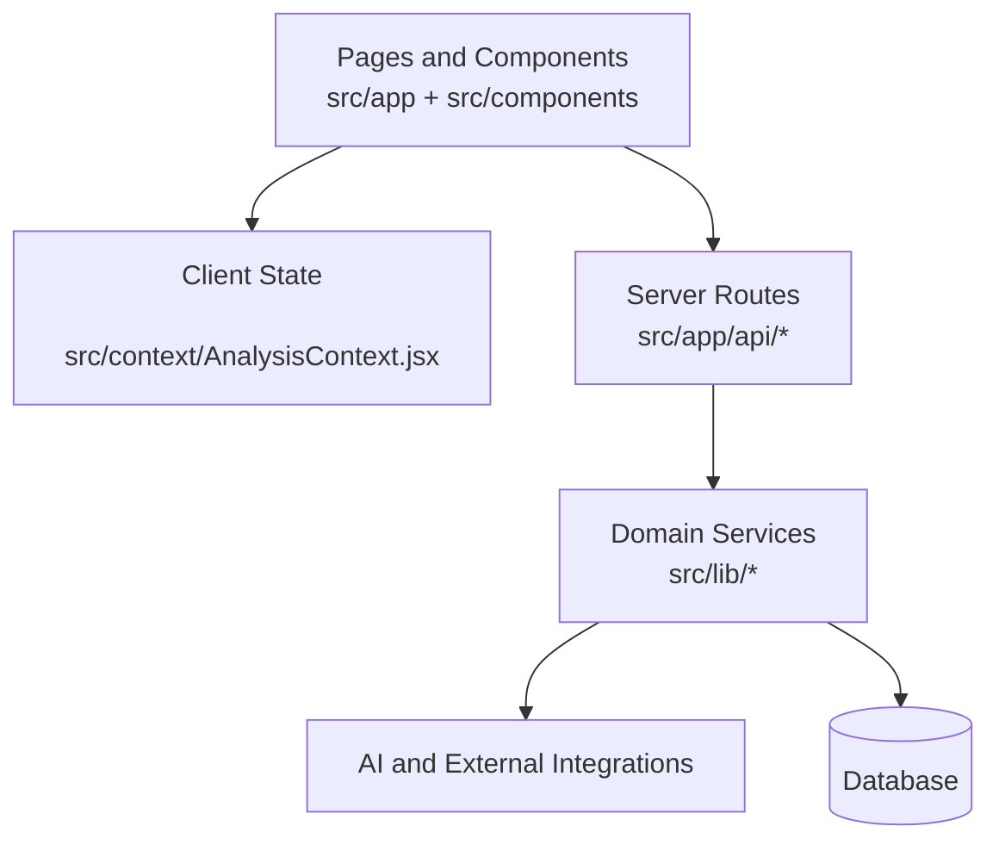

# Structural and Tool Choices: Presentation Guide + CareerCrafttemp Example

## 1) Reusable template: how to explain structural and tool choices in a presentation

Use this 7-part flow so your explanation sounds intentional, not accidental.

### A. Problem and constraints

- State user problem in one sentence.
- State constraints: performance, time-to-market, team size, deployment, data sensitivity.
- Explain how constraints drove structure.

### B. System structure (high level)

- Show layers: UI, application logic, integrations, persistence.
- Explain why boundaries exist (ownership, testability, change isolation).

### C. Module boundaries

- Identify the top modules and what each owns.
- Explain coupling decisions: what is shared vs isolated.
- Call out reuse strategy (shared components, shared services, shared context/state).

### D. Tooling choices

Present each major tool with this sentence pattern:

- We chose X because Y, and accepted Z trade-off.

Example categories to cover:

- Framework/runtime
- Styling approach
- Auth
- Data access
- AI/third-party integrations
- Linting/testing/deployment

### E. Data and request flow

- Show one critical user journey end-to-end.
- Emphasize where validation, authorization, and error handling happen.

### F. Trade-offs and alternatives

- Mention one alternative you rejected per major decision.
- Explain why it was rejected for current constraints.

### G. Evolution plan

- What scales first (features, traffic, team).
- Where you would split modules/services later.
- What observability/tests you’d add next.

---

## 2) CareerCrafttemp-specific example (based on current project structure)

### A. Structural narrative you can present

This project is organized as a Next.js app-router monolith with clear internal layering:

- Route and page entry points in `src/app`
- API endpoints in `src/app/api`
- Reusable UI in `src/components`
- Shared client state in `src/context/AnalysisContext.jsx`
- Domain/integration utilities in `src/lib`

This structure suggests a deliberate choice: keep deployment simple (single app), while separating responsibilities by folder boundary.

### B. Tool-choice explanation you can give

- Next.js app router (seen in `src/app/layout.js` and route folders): chosen for unified frontend + backend delivery, reducing integration friction.
- Component-driven UI (many files in `src/components`): chosen for reuse across analysis, dashboard, and session views.
- API route handlers in `src/app/api`: chosen to keep server orchestration close to app code and avoid an extra backend service.
- Shared domain utilities in `src/lib/aiService.js`, `src/lib/fileProcessing.js`, `src/lib/db.js`: chosen to centralize external calls and data access logic.
- Auth integration footprint (folder `.clerk` and auth pages in `src/app/login/[[...rest]]/page.js`, `src/app/signup/[[...rest]]/page.js`): chosen to offload identity complexity.

### C. Suggested architecture slide (specific)

### D. One concrete user-flow story you can narrate

For a resume-analysis style flow:

1. User interacts with upload or analysis UI in `src/components/FileUploader.jsx` and `src/components/AnalysisPage.jsx`.
2. Client state coordinates view transitions using `src/context/AnalysisContext.jsx`.
3. Request hits analysis endpoints such as `src/app/api/analyze/route.js` and persisted outputs via `src/app/api/analysis-results/route.js`.
4. Service logic in `src/lib/aiService.js` and processing in `src/lib/fileProcessing.js` normalize inputs and external responses.
5. Data persistence and retrieval paths use `src/lib/db.js` and related session/application routes like `src/app/api/session/route.js`, `src/app/api/sessions/route.js`, and `src/app/api/applications/route.js`.

### E. Trade-offs to explicitly state

- Monolith app routes vs separate microservices: faster iteration now, less operational overhead.
- Shared context for client state vs heavier global state framework: lower complexity for current scope.
- API routes in same repo vs external backend: easier full-stack changes per feature, with potential scaling split later.

### F. “Why this is coherent” closing line

The project shows a pragmatic full-stack structure: UI composition, route-level server orchestration, and centralized integration utilities are separated enough for maintainability while remaining in one deployable unit for delivery speed.
